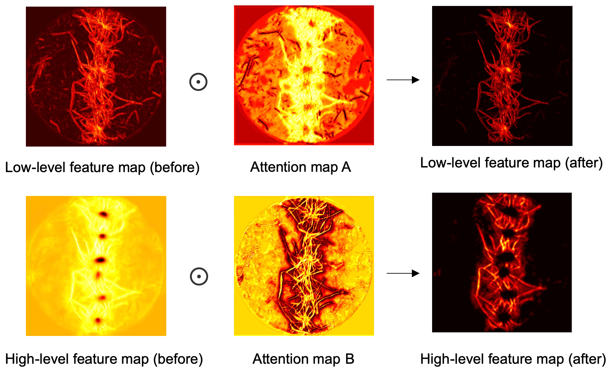
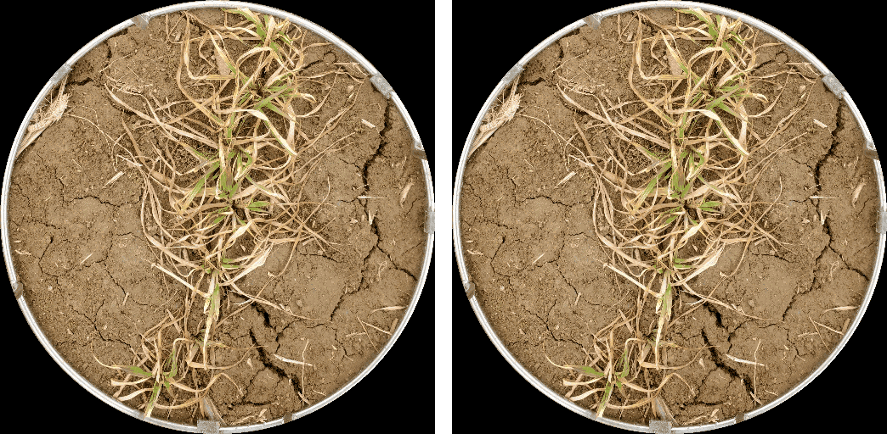

# FreezeNet: A lightweight deep learning model for enhancing freeze tolerance assessment and genetic analysis in wheat
----
## Description
### Model
FreezeNet, a lightweight neural network, is suitable for image segmentation of wheat seedlings in field environments. The network architecture is as follows:

**Figure** Architectural components of FreezeNet. **(a)** The overall architecture of FreezeNet. 
**(b)** The structure of the Inverted Residual Block. **(c)** The structure of the convolution 
block (Conv Block). **(d)** The structure of the Attention Block. 
### Attention mechanism 
This attention mechanism leverages high-level feature maps to optimize low-level feature maps by adding spatial location information. Areas with low scores in Attention Map A (black regions) correspond to dead branches and leaves close to the wheat plants, helping the model to ignore these irrelevant features. Meanwhile, low-level feature maps are used to optimize high-level feature maps by adding detail information. Areas with low scores in Attention Map B (black regions) correspond to the edges of the leaves, optimizing the finer details of the leaves.

**Figure** Illustration of attention mechanism.


## Requirements
Install dependencies using pip
```
pip install -r requirements.txt
```

## Train:
`train.py` is used to train segmentation models
```bash
python train.py
```
## Predict
`predict.py` is used to segment wheat plants from images
```bash
python predict.py
```
## Phenotyping:
The phenotyping method is in the `phenotypying.ipynb` 

Green leaves and yellow leaves segmentation



